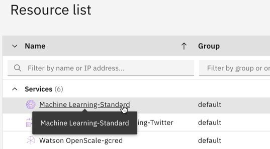
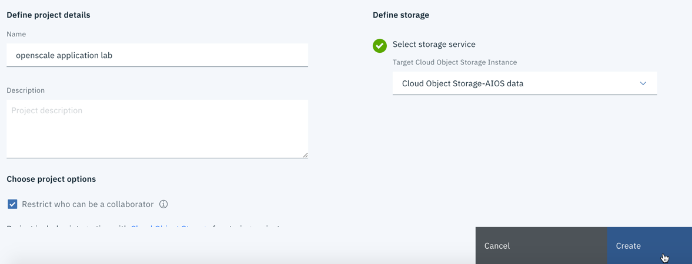
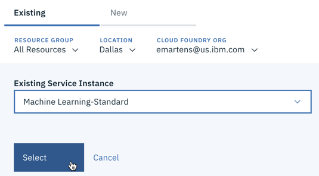
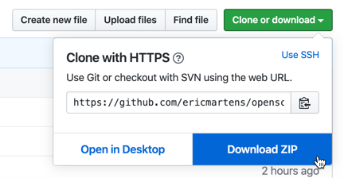
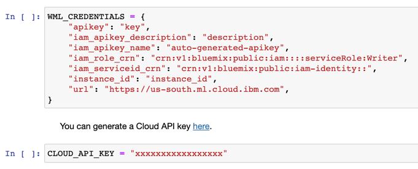
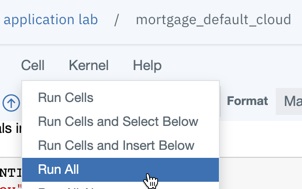
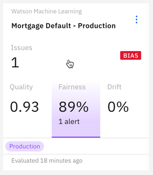
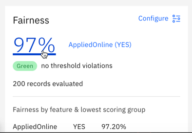
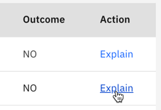

# Build, monitor and infuse AI with IBM Cloud, Watson Machine Learning, and Watson OpenScale

Welcome! The instructions below have been provided as part of an IBM Developer webcast series. By following along, you will provision IBM Cloud services, train and deploy a machine learning model, monitor that model, and finally deploy an IBM Cloud app that incorporates the model and the monitoring information.

## Prerequisites
In this step, you will provision and install the services and software you need for the hands-on lab.

1. Sign up for a free [IBM Cloud account](https://cloud.ibm.com/).
2. Sign up for a free [Watson Studio account](https://dataplatform.ibm.com/).
3. Provision a free lite instance of [Watson Machine Learning](https://cloud.ibm.com/catalog/services/machine-learning).
4. Provision a free lite instance of [Watson OpenScale](https://cloud.ibm.com/catalog/services/watson-openscale). You just need to provision the service for now. **DO NOT RUN THE AUTO-SETUP DURING THE WEBCAST.** It will take too much time to complete and you won't be able to follow along.
5. Provision a free instance of [Object Storage](https://cloud.ibm.com/catalog/services/cloud-object-storage).
6. Download and install the [IBM Cloud command line tool](https://github.com/IBM-Cloud/ibm-cloud-cli-release/releases/). This is optional if you don't want to deploy the app in the final section to IBM Cloud.

## 0. Environment setup
In this step, you will create the service credentials and projjects you need for the hands-on lab.

Start by creating credentials for Watson Machine Learning. Navigate to your [IBM Cloud Resources page](https://cloud.ibm.com/resources). From the **Resource list**, expand the **Services** section and click on the instance of Watson Machine Learning you created in the previous section.



From the menu on the left, click on **Service credentials**.


Click blue the **New credential** button.


Give your credentials a name, and then click the **Add** button.


Your new credentials will appear in the list. Click the **copy button** to copy them to your clipboard.


Open your favorite text editor and paste the credentials into a new file. We will use them in a few different locations in later steps.

Next, you'll need a Cloud API key. Navigate to the [Cloud user API key page](https://cloud.ibm.com/iam/apikeys) and click the **Create an IBM Cloud API key** button.


Give your key a name and click the **Create** button.


Click the **Copy** button to copy the key to your clipboard.


Paste the API key into your text editor file for later use.

Finally, you will need to create a Watson Studio project for your Python notebooks and models. Navigate to the [Watson Studio home page](https://dataplatform.cloud.ibm.com/) and click the **New project** button.


Click the **Create an empty project** tile.


Give your project a name. In the **Define storage** section, select the Object Storage instance you created in the previous section, and then click **Create**.



Click on the **Settings** tab at the top of the screen.


Scroll down to the **Associated services** section. Click the **Add service** button and select **Watson** from the list.


Click the **Add** button on the **Machine Learning** tile.


Select the instance of Watson Machine Learning you created in a previous step from the dropdown, and click the **Select** button.



You are now ready to begin the lab.

## 1. Create and deploy the machine learning model

Navigate to [this repo](https://github.com/ericmartens/openscale_app) and clone or download the files to your machine.



Extract the downloaded files on your machine.

Navigate to your [list of projects in Watson Studio](https://dataplatform.cloud.ibm.com/projects?context=wdp), and click on the project you created in the previous section to open it.

Click on the **Assets** tab.


In the upper section of the screen, click the **Add to project** button.


Select **Notebook**.


Select the **From file** tab, and then click on the **Drag and drop files here or upload** link at the bottom.


Navigate to the folder where you extracted the github files, open the **notebooks** folder, select **mortgage\_default_cloud.ipynb**, and then click **Open**.


Click the **Create** button to create the notebook in your Watson Studio project. When the notebook has loaded, scroll down to the first two code cells. You will want to replace the values for **WML_CREDENTIALS** and **CLOUD\_API_KEY** in these two cells with the credentials and API key you created in a previous step. Ensure that the Watson Machine Learning credentials are enclosed in the curly braces, and that the Cloud API key is enclosed in quotation marks.



You can now run the cells in the notebook. Click on the **Cell** menu and select **Run All**. You may also choose to run the cells one at a time.



The notebook will pull the training data from GitHub and use it to train a random forest classification model. It will then deploy that model as a web service to your Watson Machine Learning instance.

Next, it will use the Watson OpenScale Python client to configure explainability, drift, fairness, and accuracy monitoring for the model. Finally, it will submit enough random records from the training data to the model to engage the monitors.

The notebook is heavily commented to help you understand what each cell is doing. You may read through it for more detailed information.

When the notebook has finished running, scroll to the very bottom of the screen. You will need to copy the output of the final cell and paste it into your text file for use in the application.


## 2. Explore Watson OpenScale

Watson OpenScale monitors production machine learning models for quality, fairness, and drift. It also provides detailed explanations of model predictions.

Navigate to [Watson OpenScale](https://aiopenscale.cloud.ibm.com/aiopenscale/). Once you have signed in, you will see the Insights Dashboard, which provides an overview of the models you are monitoring. Click on the tile for the Mortgage Default model.



The notebook you ran in the previous step configured the monitors for our model, and provided enough data for the monitors to run. If you are interested in learning more about the monitors OpenScale provides, click [here](https://www.ibm.com/demos/collection/IBM-Watson-OpenScale/).

The first monitor shown is the **Fairness** monitor. It ensures that our model is not unfairly biased against a particular group. For this use case, we wanted to make sure that our model was treating online applications fairly. For more information, click the **Fairness** monitor section.



This screen shows fairness data computed hourly for the past week. Because we just built and fed data to our model, there won't be much data here yet.

On the left, you can explore the different monitors OpenScale provides. The **Quality** monitor requires scored feedback data, and calculates nine different quality metrics.

The **Drift** monitor compares the data that has been submitted to the model to the training data, and attempts to identify potential quality issues that may result if the submission data begins to vary too much from the training data.

When you are finished exploring, return to the **Fairness** graph screen and click on the left-most point on the graph.


Here we can see the breakdown for predictions made during a specific time period. Click the **View Transactions** button.


This screen provides a table with all the predictions made by the model during the selected time period. Find one you'd like to get more information about, and click the **Explain** link.



OpenScale's explanation service can take up to a minute to fully complete. When it finishes, it provides detailed information on which features from the submitted application influenced the model prediction. It can also tell you what changes need to be made to the request to result in a different prediction, and how much the request could change without altering the prediction.

In the next section, we'll take a look at how these tools might work in a real-world application.

## 3. Build an application to use the model and explanations

> **Note:** If you are having trouble with the ibmcloud command line tool in this section, you may wish to use the [Cloud Foundry command line tool](https://github.com/cloudfoundry/cli#downloads) instead. In that case, login with `cf login`, omit the `ibmcloud` portion from each command below, and skip the `ibmcloud cf install` and `ibmcloud target --cf` steps. You can also run the app from your local machine using [node.js](https://nodejs.org/).

It's time to use the credentials you've been pasting in your text editor. Navigate to the directory where you extracted the files from the repo, and edit the **auth_example.js** file. Paste your Cloud API key, Watson Machine Learning service credentials, and the Watson OpenScale information from the notebook into the correct locations in the JavaScript file.

When you are finished, save the file and then rename it to **auth.js**.

Next, open up a terminal window and run the following command to install the Cloud Foundry tools:
```ibmcloud cf install```

Next, login to your IBM Cloud account:
```ibmcloud login```

IBM employees will login with:
```ibmcloud login --sso```

Follow any prompts from the tool to select your default accounts or workspaces.

Enter the following command to target Cloud Foundry:
```ibmcloud target --cf```

The command line tool may prompt you to select an account or workspace.

Within the terminal, navigate to the directory where you extracted the GitHub repo files. The directory file listing should look like this:


Ensure that you've renamed the edited **auth_example.js** to **auth.js** to avoid breaking the app.

Enter the following command, replacing **your-app-name** with a unique application name:
```ibmcloud cf push your-app-name -m 256m```

When the command successfully completes, you can navigate to [https://your-app-name.mybluemix.net](https://your-app-name.mybluemix.net) to use the running app. You can change the details of the mortgage application to see how it affects the model's prediction, and then use the OpenScale explainability service to see exactly what is influencing each decision.

Note that the Lite version of OpenScale does limit the number of explanations you can generate each month.

## 4. Next steps

Tune in May 15 for an AutoAI presentation from Jacques Roy! And subscribe to his excellent YouTube channel, [Byte Size Data Science](https://www.youtube.com/channel/UCC00OTwEMHA2jq50m4oJ95g).

The model and application can be improved in several ways:

* More tuning could be done to the model to improve its accuracy.
* Continually feeding data into the model would provide more information for the monitors. [This notebook](https://github.com/emartensibm/mortgage-default/blob/master/mortgage_model_feed.ipynb) will allow you to schedule hourly requests. Before setting this up, take into account the limits of the free plans for Watson Machine Learning and Watson OpenScale.
* The app could certainly use a visual upgrade.
* As discussed in the [app source code](https://github.com/ericmartens/openscale_app/blob/master/main.js), it would be a good idea to render the model result and explanation result pages immediately with progress bars, then update the page when the results are available.
* OpenScale's explanation service provides both LIME and contrastive information. Currently, the app only requests and displays the LIME information. It could be updated to provide both, which would allow the user to see what changes to the record would lead to a different prediction.